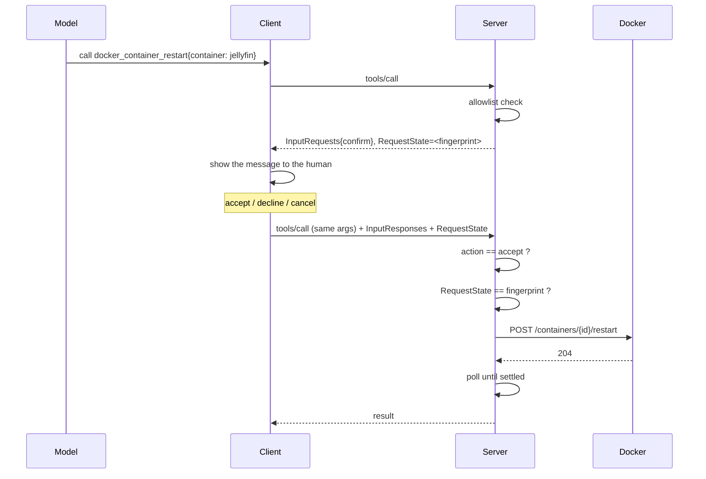

# Architecture

How this server exposes tools, how it stops mid-call to ask the user for
permission, and what the approval fingerprint does and does not protect.

This document is the **general** shape. What is specific to one integration lives
next to it:

| Module | Design notes | Tool reference |
| --- | --- | --- |
| System and systemd | [modules/system.md](modules/system.md) | [tools/SYSTEM.md](../tools/SYSTEM.md) |
| Docker | [modules/docker.md](modules/docker.md) | [tools/DOCKER.md](../tools/DOCKER.md) |
| Radarr | [modules/radarr.md](modules/radarr.md) | [tools/RADARR.md](../tools/RADARR.md) |
| Sonarr | [modules/sonarr.md](modules/sonarr.md) | [tools/SONARR.md](../tools/SONARR.md) |
| Jellyfin | [modules/jellyfin.md](modules/jellyfin.md) | [tools/JELLYFIN.md](../tools/JELLYFIN.md) |

Written against `github.com/modelcontextprotocol/go-sdk` **v1.7.0**. The
multi-round-trip behaviour described in §3 is SDK- and protocol-version
sensitive; if you upgrade the SDK, re-read that section against the new code.

---

## 1. Layout

```
cmd/server/main.go        .env loading, stdio transport, signal handling
internal/dotenv/          .env → process environment, before registration
internal/mcp/             protocol layer — registration, handlers, rendering, confirmation,
                          prompts and resources
internal/overview/        every cheap check at once          (composes the collectors below)
internal/system/          host, CPU, memory, disk            (gopsutil)
internal/services/        systemd units                      (systemctl)
internal/containers/      docker                             (Engine API over the unix socket)
internal/radarr/          radarr                             (v3 HTTP API)
internal/sonarr/          sonarr                             (v3 HTTP API)
internal/jellyfin/        jellyfin                           (HTTP API)
```

One rule holds the layering together: **`internal/mcp` never touches the OS, and
the collectors never know MCP exists.** The collectors return plain structs; the
protocol layer decides how to present them.

That rule has one consequence worth stating on its own, because it was
originally violated and the bug it caused was invisible: **warnings are computed
in the collector, not in the renderer.** An inode warning that exists only in
the rendered table is invisible to any client that reads `structuredContent`
instead of `content` — which is half the protocol. If a fact is worth telling
the user, it belongs in the struct.

---

## 2. How a tool is served

### Registration

Everything is registered in `internal/mcp/register.go` through the SDK's
generic helper:

```go
sdk.AddTool(s, &sdk.Tool{
    Name:        "system_disk_usage",
    Annotations: &sdk.ToolAnnotations{Title: "System Disk Usage", ReadOnlyHint: true},
    Description: "...",
}, handleDiskStats)
```

`AddTool` is generic over the handler's input and output types. From those two
Go types it generates the tool's **`inputSchema` and `outputSchema`** by
reflection, so the schema the model sees is derived from the struct — it cannot
drift from the code. `jsonschema:"..."` struct tags become field descriptions:

```go
type diskInput struct {
    IncludeAll bool `json:"include_all,omitempty" jsonschema:"if true, includes pseudo-filesystems, snaps and duplicate mounts that are normally filtered out"`
}
```

Those tags are the only documentation the model gets about a parameter. Treat
them as prompt text, not as comments.

### Handler shape

Every handler has the same signature:

```go
func(ctx context.Context, req *sdk.CallToolRequest, in In) (*sdk.CallToolResult, Out, error)
```

The two return values feed the two channels of a tool result:

| Return | Becomes | Read by |
|---|---|---|
| `Out` (the struct) | `structuredContent` | clients that parse JSON |
| `*sdk.CallToolResult` | `content[]` | clients that read text |

Two patterns are in use:

- **Return `nil` for the result** (`handleHostInfo`) — the SDK serializes `Out`
  into both channels. Right when the struct is already readable.
- **Return a `CallToolResult` holding rendered text** (everything else) — the
  text goes to `content`, `Out` still goes to `structuredContent`. Right when a
  table beats raw JSON.

Rendering is deliberate, not decorative: `system_disk_usage` returns a `df`-style
table and `system_memory_stats` a `free`-style one, because that shape is dense
and already familiar. The shared table renderer lives in `internal/mcp/render.go`.
Different clients favour different channels — some display `content`, some drop
it entirely when `structuredContent` is present — which is exactly why neither
channel is allowed to carry a fact the other lacks.

### Annotations

`ToolAnnotations` are **hints for the client's UI, not enforcement.** Nothing in
the SDK or the server refuses a call because `ReadOnlyHint` was true. They exist
so a client can group tools, warn before a destructive one, or skip a
confirmation for a safe one. `DestructiveHint` and `OpenWorldHint` default to
`true`, which is why `ptr(false)` exists in `render.go` — a plain `bool` cannot
express "explicitly false" for a `*bool` field.

### Conditional registration

A tool the environment does not authorise is **never created**, which is a
stronger guarantee than one that exists and refuses:

```go
if allowed := containers.ActionAllowlist(); len(allowed) > 0 { ... }  // docker actions
if radarr.Configured() { ... }                                       // the radarr family
if radarr.ReadOnly() { return }                                      // its four writes
if sonarr.Configured() { ... }                                       // and the same, per service
if jellyfin.Configured() { ... }                                     // both jellyfin tools
```

Jellyfin has no `ReadOnly()` predicate, and its absence is the rule rather than
an omission: both of its tools are reads, so the switch would gate nothing — and
a setting that turns nothing off is worse than an absent one, because an
operator who sets it believes something happened. It arrives with the first
write.

**Which means the environment must be complete before `New()` is called.**
`cmd/server/main.go` loads the `.env` first for exactly that reason: a variable
that arrives after registration changes nothing, because the tool it would have
enabled was already not created. `internal/dotenv` never overwrites a variable
that is already set, so the file is a fallback for a binary launched with no
configuration — an MCP client execs it directly, with no shell to source
anything, and a client's `env` block does not survive an ssh hop. Whatever the
operator supplied deliberately still wins.

The same predicates decide the prompts and the resources, for a stronger reason:
a tool that does not exist cannot be called, but a **procedure** naming a tool
that does not exist reads as authoritative and sends the model at nothing. So
`why-no-download` is not registered without an `*arr`, and the tool names inside
both prompts expand to the ones this install actually has.

The result is 8 tools on a default install and up to 30 fully configured:

| Family | Always | Needs config | Confirms |
|---|---|---|---|
| Overview (1) | all | – | – |
| System (5) | all | – | – |
| Docker (4) | status, logs | exec, restart — **allowlist** | exec, restart |
| Radarr (8) | – | all — **URL + API key** | add, search, remove, queue_remove |
| Sonarr (10) | – | all — **URL + API key** | add, season_monitor, search, remove, queue_remove |
| Jellyfin (2) | – | all — **URL + API key** | – |

The three service families gate independently: one configured and the others not
is a normal install, and each has its own key. Jellyfin has a second axis the
others do not — most of what its health tool reads is administrator-only, so a
key that authenticates can still be refused per request. That is handled inside
the module rather than at registration: a tool that exists and answers with the
sections it could read beats one that is absent because a subset of its requests
would fail. See [modules/jellyfin.md](modules/jellyfin.md#admin-rights-are-a-second-axis-of-configured).

### Prompts, resources, and what belongs in each

Three surfaces, and the choice between them is not stylistic. A **tool** answers
a question about the machine right now. A **resource** holds reference data that
is stable and that a client can attach once. A **prompt** holds a procedure —
knowledge about the order to do things in, which no single tool description can
carry because a model meets those one at a time.

The test that settled every case here: *would this be a round trip whose
successful outcome is an error?* Discovering a quality profile today means
guessing a name and reading the refusal that lists them. That is reference data
wearing a tool's clothes, so it became
[a resource](../tools/RESOURCES.md). And *would a model reading only one tool
description ever learn this?* The reason a Sonarr search finds nothing is that
the season is unmonitored — a fact that lives in a different tool entirely, so it
became [a prompt](../tools/PROMPTS.md).

Resources are `text/markdown` rather than JSON. A resource has one channel, not
the two a tool result has, and its content is read rather than computed on — so
the tables are written for the reader, with byte counts rendered human-readable
in place, exactly as a tool's text channel does it.

### The overview composes; it does not duplicate

`homelab_overview` runs every cheap check at once and reports only what needs
attention. It lives in `internal/overview/`, which imports the other collectors
and imports nothing from `internal/mcp` — the same rule as every other collector,
applied to a collector whose sources are collectors.

**Every warning it reports is the one that area's own tool produced, unchanged.**
That is what stops the overview and the tool behind it from ever disagreeing, and
it is why the overview cannot be the place a new judgement is invented. It makes
exactly two of its own, both stated where they are computed and both conditions
no existing collector calls a warning: a writable filesystem over 90%, and memory
over 90% or swap over 50%.

**It drops warnings in exactly one place, and that is a different act from
altering one.** Jellyfin's health collector marks its encoding findings as
`StandingWarnings`: they describe how the server is *configured* rather than
what is wrong with it *now*. A machine with no GPU has no hardware acceleration
every second of its life, and an overview that opens with that on every glance
is one nobody reads twice — so the jellyfin section leaves them out and stays
`ok`. The two surfaces do not disagree, because they are not answering the same
question: `jellyfin_system_health` is asked "how is this set up", and it still
reports every one of them. And the condition stops being standing the moment
something is paying for it, which arrives in the overview anyway — as a
software-transcode warning out of the session list.

Two distinctions it holds that a simple aggregate would lose:

- **Absent is not failed.** A host with no Docker daemon and a host whose Docker
  daemon is refusing connections are different answers with different fixes.
- **Fullest is not filling up.** The disk section is about the fullest filesystem
  something can still *write* to. A read-only mount at 100% is an ISO or a
  squashfs image, and reporting it is how a monitor teaches its reader to ignore
  it.

---

## 3. Waiting for a user response

### The problem

A tool call is one request and one response. A confirmation needs the server to
stop halfway, reach the human, and continue only if the answer is yes. Nothing
in a plain `tools/call` allows that.

### The mechanism

MCP's multi-round-trip flow (SEP-2322) gives the handler a way to answer "not
yet, ask this first". `internal/mcp/confirm.go` implements it in one place for
every action tool — it is the security boundary of the whole server, so a fix
applied to one copy and missed in another would fail silently — and returns a
three-state result:

```go
func requireApproval(req *sdk.CallToolRequest, a approval) (bool, *sdk.CallToolResult, error)
```

| Return | Meaning | What the handler does |
|---|---|---|
| `(false, pending, nil)` | ask the user | return `pending` unchanged |
| `(false, nil, err)` | do not proceed | return `err` |
| `(true, nil, nil)` | approved | perform the action |

**First pass** — the handler returns a result carrying no content, but an
input request and a `RequestState`:

```go
&sdk.CallToolResult{
    InputRequests: sdk.InputRequestMap{
        confirmKey: &sdk.ElicitParams{
            Message:         a.message,
            RequestedSchema: emptyElicitSchema(),
        },
    },
    RequestState: a.fingerprint,
}
```

Nothing else is in that response — `content` is `null` and the structured output
is the zero value. **The model learns nothing from the first pass**, deliberately:
a response full of data would read as a response, and the operation has not
happened yet.

**Second pass** — the client shows the message, collects the decision, and
**re-calls the same tool with the same arguments**, now carrying
`InputResponses` and echoing `RequestState`. `requireApproval` runs again, takes
the second branch, and validates the answer.



### Two kinds of client

Whether the server can reach the human at all depends on a capability the client
declares at `initialize`:

- **Declares `elicitation`** — the server asks directly, per command, showing
  the exact command. This is the path above.
- **Does not declare it** (Claude Desktop, at the time of writing) — the server
  has no channel of its own. Those clients prompt for tool approval themselves,
  so a human is still in the loop, but the prompt is **per-tool, not
  per-command**, and a client set to always-allow stops asking.

For the second case the server refuses by default. Setting
`HOMELAB_MCP_TRUST_CLIENT_CONFIRMATION=1` makes it defer to the client's own
prompt instead. That variable is the operator vouching for their setup, and it
has to be the operator: **the identity a client reports at `initialize` is
self-declared and unauthenticated**, so a server cannot recognise a trustworthy
client — it can only be told. This is also why `clientName` feeds only the log
and the refusal message, and never a branch.

There is a third shape, invisible from the handler: on protocol versions before
`2026-07-28` the SDK drives the round trip itself, sending the client an
`elicitation/create` request and re-invoking the handler with the response. On
later versions the input-required result goes back to the client, which retries.
`requireApproval` is written against the handler's view and works either way.

Which path a session got is logged once, at connect time:

```
client connected: name="claude-ai"; confirmations for actions: server-side, per command
client connected: name="claude-ai"; confirmations for actions: the client's own approval prompt
```

Without that line a refusal later looks arbitrary.

### `requestedSchema` is required

Form-mode elicitation requires `requestedSchema` in the MCP spec, even when the
server wants no fields back — the decision *is* the answer. We send an empty
object schema:

```go
map[string]any{"type": "object", "properties": map[string]any{}}
```

The Go SDK's own client tolerates its absence (`validateElicitSchema(nil)`
returns no error), so the round trip worked without it; a stricter client
following the published schema would not. Two consequences of sending it:

- Empty `properties` does **not** imply `additionalProperties: false`, so a
  client that returns content alongside its accept still validates.
- Sending a schema switches on result validation in the SDK, on both sides.

### Reading the answer

Anything short of an explicit accept stops the action:

| Answer | Outcome |
|---|---|
| `accept` | proceed to the fingerprint check |
| `decline` | `<refusal>: the user declined it` |
| `cancel` | `<refusal>: the user dismissed the confirmation without deciding` |
| anything else | `<refusal>: unrecognised confirmation action %q` |
| key missing | `<refusal>: no confirmation was returned` |
| wrong type | `<refusal>: confirmation response was not understood` |

The `refusal` prefix ("command not run", "movie not added", "no search was
started") is phrased so that whatever the model reports back names **what did not
happen**. A model that paraphrases an error loosely still cannot turn it into
"done".

---

## 4. Security

### 4.1 The layers

| Layer | Applies to | Bypassable by |
|---|---|---|
| Registration gate | every action tool | nothing outside this server |
| Docker allowlist | exec, restart | nothing outside this server |
| Human confirmation | every action tool | a client that auto-approves |
| Fingerprint | every action tool | a client that replays state |

The first two are the ones that hold regardless of how a client or a model
behaves. What each module gates on is in its own page:
[docker](modules/docker.md#the-three-layers),
[radarr](modules/radarr.md#configuration-and-reachability),
[sonarr](modules/sonarr.md#configuration).

### 4.2 The fingerprint

The gap the other layers leave: the confirmation and the execution are **two
separate tool calls**, and the second carries its own arguments. Without a
binding, a user could approve `ls /config` and the retry could arrive as
`rm -rf /config` — same tool, same session, different arguments, and the server
would have no way to notice.

`RequestState` closes that. The server puts a fingerprint of the exact operation
into the first response, the client echoes it back, and the server recomputes it
from the arguments it just received:

```go
if req.Params.RequestState != a.fingerprint {
    return false, nil, fmt.Errorf(
        "%s: the approved operation does not match the one submitted", a.refusal)
}
```

There are two implementations. The generic one, `internal/mcp/confirm.go`:

```go
func fingerprint(parts ...string) string {
	h := sha256.New()
	for _, p := range parts {
		binary.Write(h, binary.BigEndian, uint32(len(p)))
		h.Write([]byte(p))
	}
	return hex.EncodeToString(h.Sum(nil))[:32]
}
```

Callers pass the tool name as the first part. The older
`containers.Fingerprint(container, argv)` predates it and does not mix the tool
name in; the two want unifying.

**Why the length prefixes.** Concatenating the parts would make `["rm","-rf"]`
and `["rm-rf"]` hash identically — the boundary between two values is semantic,
and a hash that ignores it lets an approval for one operation authorise a
different one. Writing each part's length before its bytes makes the encoding
unambiguous.

| Property | Result |
|---|---|
| `["rm","-rf"]` vs `["rm-rf"]` | different |
| `("ab",["x"])` vs `("a",["bx"])` | different |
| output width | 32 hex chars = 128 bits |

**Why 128 bits.** The property that matters is second-preimage resistance —
finding a *different* operation with the same fingerprint. 128 bits is far beyond
reach, and the value is echoed through a client, so a shorter string keeps the
protocol traffic readable.

**What it proves:** the operation now being executed is byte-for-byte the one
that was shown to the human.

**What it does not prove:**

- **Not freshness.** There is no nonce and no server-side record of issued
  fingerprints. It proves *same operation*, not *fresh approval*. A client that
  replayed a stored `RequestState` for an identical operation would pass. In
  practice `RequestState` is protocol-level and constructed by the client, not by
  the model — but the server does not enforce that.
- **Not the tool identity, for the Docker tools.** `containers.Fingerprint`
  covers `(container, argv)` only, and `docker_container_restart` uses the
  synthetic argv `["restart"]`, which **collides with an exec of the literal
  command `restart` in the same container** — verified: both produce
  `60139298fc75342a03fa46ad79c8117c` for `radarr`. Not currently reachable,
  because a well-behaved client builds `RequestState` itself and the model never
  chooses it. Closing it is one line: use the generic helper.
- **Not the user's identity.** The server knows a decision came back through the
  session. It has no idea who made it.

### 4.3 Where an argument is not self-describing, fingerprint the resolution

The Docker tools hash arguments the caller supplied, and that is enough because
`(container, argv)` says everything about what will happen.

The Radarr and Sonarr tools cannot: `tmdb_id: 438631` and `queue_id: 9` mean
whatever the service currently says they mean, and the service changes
underneath. So those handlers **resolve first and hash the resolution** — the
film, the quality profile, the folder, the queue item's title — on both passes.
The human then approves "Dune (2021) at UHD-2160p into /movies" rather than a
number, and state that moved between the confirmation and the retry produces a
mismatch instead of an action against different values. Worked examples in
[modules/radarr.md](modules/radarr.md#adding-resolve-first-act-second).

Sonarr adds a second thing to hash, because there the arguments hide **how much**
an operation does as well as what it touches. `sonarr_series_search` is one tool
over three Sonarr commands, so the resolved scope — series, season, sorted
episode ids — is what gets fingerprinted, and an approval for one season cannot
execute against the whole series. Likewise the number of episodes riding on a
queue row: a row that was one episode when it was shown and a fourteen-episode
season pack by the time it was approved is a different removal, and hashes as
one. See [modules/sonarr.md](modules/sonarr.md#scale-is-part-of-the-operation).

The general shape: **a confirmation is only worth as much as the distance between
what the human read and what the code then did.**

### 4.4 Untrusted input that reaches something that executes

Two places take a model-supplied string toward execution, and each is handled in
its module:

- **systemd unit names** reach `systemctl`'s argv —
  [modules/system.md](modules/system.md#running-systemctl)
- **container names** never reach a request path at all —
  [modules/docker.md](modules/docker.md#no-caller-supplied-string-reaches-a-request-path)

### 4.5 Bounds

Every call out of this process is bounded, and every cap is reported rather than
silent. Silent truncation reads as a complete answer.

| Bound | Value | Why |
|---|---|---|
| `systemctl` timeout | 5s | systemd wedged would otherwise block the call |
| Docker API timeout | 5s | same, for an unresponsive daemon |
| statfs timeout | 2s | a dead NFS mount hangs statfs for minutes and ignores `ctx` |
| exec timeout | 30s default, 120s max | |
| exec output | 16 KiB, truncation reported | |
| log output | 16 KiB, truncation reported | |
| restart settle | 15s, 3s stable window | Docker reports "running" the instant the process spawns |
| Radarr/Sonarr API timeout | 10s | answered from the service's local database |
| Jellyfin API timeout | 10s | answered from memory or its own database |
| Jellyfin session window | 900s | anything playing checks in constantly, so this excludes only idle devices |
| Radarr/Sonarr lookup timeout | 30s | proxied to a metadata service over the internet |
| Radarr/Sonarr queue page | 200 items | the API pages at 10 |
| Radarr/Sonarr library listing | 25 default, 200 max | a full dump buries the answer |
| Sonarr episode listing | 25 default, 200 max | a library-wide Wanted list runs to thousands |

---

## 5. When something looks wrong

| Symptom | Where to look |
|---|---|
| Model says it has no action tools | Allowlist unset in the environment the server actually got — for an SSH-launched server, the `env` block in the client config reaches only the local `ssh` process, not the remote one |
| Model says it has no Radarr tools | One of `SERVER_URL` / `RADARR_API_KEY` is unset, or the URL would not parse — the connect-time log says which |
| Model says it has no Sonarr tools | Same, for `SERVER_URL` / `SONARR_API_KEY` |
| Model says it has no Jellyfin tools | Same, for `SERVER_URL` / `JELLYFIN_API_KEY` |
| One service answers and another does not | `SERVER_URL` names a port, so it can only reach one of them — it has to stay a bare host for each to resolve its own (7878, 8989, 8096) |
| Jellyfin health is missing its storage, tasks and plugins | The key authenticates but is not an administrator key; the warnings say so per section (§ [jellyfin](modules/jellyfin.md#admin-rights-are-a-second-axis-of-configured)) |
| Jellyfin rejects a key that is definitely correct | It was sent as `X-Api-Key`, the way the `*arr` clients do it. Jellyfin reads neither that nor `X-Emby-Token` — only its own `Authorization: MediaBrowser …` scheme |
| `Failed to call tool` on an action | Client declares no elicitation and `HOMELAB_MCP_TRUST_CLIENT_CONFIRMATION` is unset — see the connect-time log line |
| Approved but refused | Fingerprint mismatch: the retry carried different arguments — or, for Radarr, the state it resolved against moved (§4.3) |
| A warning is missing from one client | It was built in the renderer instead of the collector (§1) |
| A `.env` exists and had no effect | It is not on the search path (beside the executable, one above, then the cwd — never trust the cwd), or the variable was already set in the environment and left alone. Neither is logged — only a file that failed to parse is |
| Radarr answers a web page, not JSON | The URL points at a reverse proxy or the wrong port, or a subfolder install is missing its url base |
| A tool changed but the model still sees the old schema | Schemas are generated at registration; restart the MCP client |

---

## 6. Where to change what

| Change | File |
|---|---|
| Add a tool | `internal/mcp/register.go` + a `tool_*.go` |
| Change what the user reads before approving | the `approval.message` in the tool's handler |
| Change the confirmation flow itself | `internal/mcp/confirm.go` — one place, on purpose |
| Change table formatting | `internal/mcp/render.go` |
| Change what may be acted on | `internal/containers/allowlist.go` |
| Change how Radarr, Sonarr or Jellyfin is addressed or authenticated | `internal/radarr/client.go`, `internal/sonarr/client.go`, `internal/jellyfin/client.go` |
| Change what a Jellyfin stream is judged to cost | `classifyWork` in `internal/jellyfin/sessions.go` |
| Change what is resolved before an add is approved | `radarr.Plan` / `sonarr.Plan` in the module's `add.go` |
| Change how much a Sonarr search covers | `sonarr.ResolveSearch` in `internal/sonarr/search.go` |
| Change where configuration is read from | `internal/dotenv/` |
